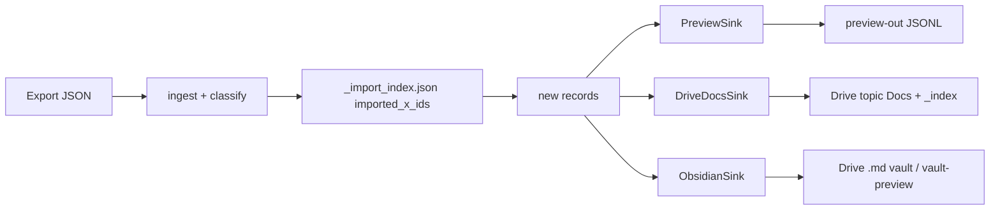

# Obsidian second sink - Plan

## Goal Capsule

- **Objective:** Add an explicit Obsidian sink beside Google Docs. Live Obsidian uploads real `.md` files into Drive folder `Obsidian Vault - X Bookmarks` (`1fzceV_WpXsNSOwNk_GgiXhlP2D668li6`) with Docs conversion off. Docs `--live` stays on `DRIVE_FOLDER_ID`.
- **Authority:** This plan. Product rules live on R-IDs. A 2026-09-18 PLAN LOCK from Jabba supersedes local-vault-path KTDs: Obsidian is phone-only via Drive Markdown, not a computer vault path.
- **In scope:** Obsidian Drive `.md` sink + CLI/env selection; shared `_import_index.json` contract; Docs glossary/TOC + newest-first parity; README; dry-run proof under `vault-preview/`.
- **Out of scope:** X write actions; inventing tweet text; local `OBSIDIAN_VAULT_PATH`; changing Docs folder id `1sF85Lq7kU9y8y73GPyNqFl9I2ACayQBG`; converting Obsidian notes into Google Docs.
- **Execution profile:** Test-first against `fixtures/bookmarks.fixture.json`. Stdlib unittest. No Google credentials.
- **Stop:** Docs-only `--live` / dry-run JSONL path regresses; Obsidian becomes the silent default; tweet `text` is not verbatim from the export; `_import_index.json` shape breaks Docs dedup.
- **Tail ownership:** Caller pipeline owns simplify, review, PR, CI.

---

## Product Contract

### Summary

Vault Scout already runs ingest → classify → Docs. Operators now want the same records in an Obsidian vault with topic folders, a glossary/TOC at the top of the Index and each topic note, and newest-date-first ordering — without dropping Docs.

### Problem Frame

`docs_format.py` states the Markdown dump is not an Obsidian layout. Drive Docs append at the end and the Index has a topic list, but not a top glossary/TOC or newest-first entries. A second sink must be explicit so existing `--live` hosts keep writing Drive.

### Requirements

**Sink selection**

- R1. Operators select Obsidian explicitly (`--sink obsidian`, `--obsidian`, or equivalent env). Docs remains the default when the flag is omitted.
- R2. `--live` with the Docs sink still writes Google Docs in `DRIVE_FOLDER_ID` (Jabba’s folder id stays the default).
- R3. `--live` with the Obsidian sink uploads `.md` files (not Google Docs) into `OBSIDIAN_DRIVE_FOLDER_ID` (default `1fzceV_WpXsNSOwNk_GgiXhlP2D668li6`, folder title **Obsidian Vault - X Bookmarks**). It never writes a local computer vault path.
- R4. Dry-run remains the default for both sinks. Obsidian dry-run writes a reviewable Markdown tree under `--out` (default `vault-preview`) mirroring the Drive vault layout. No Drive writes.

**Obsidian layout**

- R5. Inside the Obsidian Drive vault folder: `Index.md` plus topic folders `Fashion`, `Markets`, `AI`, `Career`, `Media`, `Misc`, and `needs-review`.
- R6. An Index note and each topic note start with a glossary/TOC (MOC). Index glossary links sibling topic notes.
- R7. Notes are grouped by topic folder. Within the Index and each topic note, entries are newest `saved_at` first.
- R8. Each bookmark note has YAML frontmatter `url`, `author`, `x_id`, `saved_at`, `topics` (list), `source: x-bookmark`. Confidence may appear. Body text is the export `text` only.

**Shared pipeline**

- R9. Dedup uses `_import_index.json` `imported_x_ids` via existing `x_bookmark/import_index.py`. Docs dry-run and live dedup stay valid.
- R10. X stays read-only. The tool never posts, likes, replies, unfollows, or deletes bookmarks. It never invents tweet text.

**Docs addendum**

- R11. Each Google Doc (Index and topic Docs) has a glossary/TOC at the top. Index glossary links sibling topic Docs. Topic Doc entries are newest `saved_at` first. Apply only because main’s Drive sink lacks this; do not change folder id, auth, or skip-on-seen-`x_id`.

### Key Decisions

- KD1. Obsidian is a second sink, not a replacement. Governs R1, R2. (session-settled: user-directed — chosen over silently replacing Docs: Vault Scout still runs Drive `--live`.)
- KD2. Topic folders match existing `ALL_DOC_NAMES`. Governs R5. (session-settled: user-directed — chosen over a flat vault or different folder names: parity with Vault Scout Docs layout.)
- KD3. Glossary/TOC belongs at the top of Index and topic notes. Governs R6, R11. (session-settled: user-directed — chosen over body-only notes: Vault Scout asked for MOC-first Docs and Obsidian.)
- KD4. Order is topic folder, then newest date first inside each Index/topic note. Governs R7, R11. (session-settled: user-directed — chosen over append-at-end: current Drive sink appends oldest-last.)
- KD5. Dedup stays on `_import_index.json` `imported_x_ids` with the current helper contract. Governs R9. (session-settled: user-directed — chosen over a separate Obsidian-only index: must not break Docs dedup.)
- KD6. Live Obsidian writes Markdown into Drive folder `1fzceV_WpXsNSOwNk_GgiXhlP2D668li6` (`OBSIDIAN_DRIVE_FOLDER_ID`). Dry-run may write `vault-preview/` for PR review. Not a local computer vault — Obsidian is phone-only. Governs R3, R4. (session-settled: user-directed — chosen over `OBSIDIAN_VAULT_PATH` / local disk vault: phone-only Obsidian syncs this Drive folder.)
- KD7. Bookmark notes carry the listed frontmatter; `confidence` is optional. Governs R8. (session-settled: user-directed — chosen over body-only Markdown: Vault Scout wants those fields.)

### Actors

- A1. Vault Scout — read-only X consumer; runs this CLI.
- A2. Jabba — Docs folder `DRIVE_FOLDER_ID` and Obsidian Drive folder `OBSIDIAN_DRIVE_FOLDER_ID` (both documented defaults).
- A3. PR reviewer — inspects `vault-preview/X Bookmarks/` without Drive auth.

### Flows

- F1. Docs dry-run (default)
  - **Trigger:** `sync --input <export>` with no `--sink` and no `--live`.
  - **Steps:** ingest, classify, skip seen `x_id`s, write JSONL + `_import_index.json` under `preview-out`.
  - **Outcome:** no Drive calls; existing preview tests still pass.
  - **Covered by:** R1, R2, R9, R10
- F2. Docs live
  - **Trigger:** `sync --input <export> --live` (sink omitted or `docs`).
  - **Steps:** same classify/dedup; DriveDocsSink writes topic Docs + `_index` + `_import_index.json` in the Drive folder.
  - **Outcome:** glossary/TOC at top; new/updated entries newest-first; skip already imported ids.
  - **Covered by:** R2, R9, R11
- F3. Obsidian dry-run
  - **Trigger:** `sync --input <export> --sink obsidian` (or `--obsidian`) without `--live`.
  - **Steps:** same classify/dedup against `{out}/_import_index.json`; write Index.md, topic folders, per-bookmark notes, topic MOCs.
  - **Outcome:** `{out}/` (default `vault-preview`) mirrors the Drive vault; no Drive writes.
  - **Covered by:** R1, R4, R5–R8, R9
- F4. Obsidian live
  - **Trigger:** `--sink obsidian --live` with `OBSIDIAN_DRIVE_FOLDER_ID` (documented default).
  - **Steps:** same tree uploaded as `text/markdown` files (and JSON index) into that Drive folder. Never `application/vnd.google-apps.document`.
  - **Outcome:** phone Obsidian can open the folder; Docs folder is untouched.
  - **Covered by:** R3, R5–R9

### Acceptance Examples

- AE1. Default Docs dry-run unchanged
  - **Covers:** R1, F1
  - **Given:** fixture export and no `--sink`
  - **When:** dry-run into a temp dir
  - **Then:** `imported: 5`, JSONL records exist, no `X Bookmarks/` vault tree is required, Drive is not called
- AE2. Obsidian dry-run layout
  - **Covers:** R4–R8, F3
  - **Given:** fixture export and `--sink obsidian`
  - **When:** dry-run to `vault-preview` or temp out
  - **Then:** folders exist for every `ALL_DOC_NAMES` entry (empty topics still get a folder + MOC); Index and topic notes start with glossary/TOC; AI note lists the 2026-09-16 fixture before older dates; bookmark notes include frontmatter + `[FIXTURE]` verbatim text
- AE3. Obsidian second run skips
  - **Covers:** R9
  - **Given:** AE2 already wrote `_import_index.json`
  - **When:** the same command runs again
  - **Then:** `imported: 0`, `skipped: 5`, existing notes are not duplicated
- AE4. Docs live fake client TOC
  - **Covers:** R11, F2
  - **Given:** `FakeDriveClient` and `--live` without `--sink`
  - **When:** fixture syncs
  - **Then:** `_index` starts with a glossary linking topic Docs; topic Doc text has TOC then the newest heading before older ones; second run still skips five ids
- AE5. Live Obsidian uploads Markdown, not Docs
  - **Covers:** R3
  - **Given:** `--sink obsidian --live` and FakeDriveClient
  - **When:** fixture syncs
  - **Then:** files named `Index.md` / `*.md` have Markdown mime (not Google Docs); folder id is the Obsidian vault id; Docs `DRIVE_FOLDER_ID` is unused

### Success Criteria

- Reviewers can run Obsidian dry-run on the fixture and see `vault-preview/` (Index.md + topic folders) with TOC + newest-first.
- `python3 -m unittest discover -s tests -v` covers both sinks. Existing Docs preview and fake-Drive tests stay green.
- README documents Docs vs Obsidian, `OBSIDIAN_DRIVE_FOLDER_ID`, no Docs conversion, and dry-run vs live.

### Scope Boundaries

**Deferred to Follow-Up Work**

- Point phone Obsidian at Drive folder `1fzceV_WpXsNSOwNk_GgiXhlP2D668li6`.
- Optional LLM classifier (`X_BOOKMARK_CLASSIFIER`) is unchanged.

**Outside this product's identity**

- X write APIs.
- Invented tweet bodies.
- Concurrent live locks.

### Sources

- Repo `README.md`, `x_bookmark/cli.py`, `x_bookmark/sync.py`, `x_bookmark/sinks/preview.py`, `x_bookmark/sinks/drive_docs.py`, `x_bookmark/docs_format.py`, `x_bookmark/import_index.py`, `tests/test_sync_preview.py`, `tests/test_drive_docs.py`.
- Docs Drive folder id `1sF85Lq7kU9y8y73GPyNqFl9I2ACayQBG` remains the Docs default.
- Obsidian Drive folder id `1fzceV_WpXsNSOwNk_GgiXhlP2D668li6` is the Obsidian default.

---

## Planning Contract

### Key Technical Decisions

- KTD1. CLI sink switch is `--sink {docs,obsidian}` default `docs`, with `--obsidian` as an alias. Env `X_BOOKMARK_SINK` is optional and must not override an explicit flag. `--obsidian` together with `--sink docs` is a CLI error. (session-settled: user-directed — chosen over replacing Docs when Obsidian is configured: R1/R2 require Docs to stay the omitted-flag path.) Instantiates KD1; Governs R1, R2.
- KTD2. Obsidian layout is per-bookmark notes plus MOCs at the **Drive vault root** (that folder is the vault; do not nest another `X Bookmarks/` directory). Paths: `Index.md`, `{Topic}/{Topic}.md`, `{Topic}/{date}-{author}-{x_id}.md`. Topic MOC and Index hold glossary/TOC and newest-first wikilinks. Bookmark notes hold frontmatter + verbatim text. Instantiates KD2, KD3, KD7.
- KTD3. Each sink has its own `_import_index.json` file with the **same schema** (`imported_x_ids`, `topic_docs`, `index_doc`) via `import_index.py`. Docs dry-run keeps it at `{out}/_import_index.json`. Obsidian keeps it at the vault root (`{out}/_import_index.json` dry-run, Drive vault folder live). Do not merge Docs and Obsidian indexes. Instantiates KD5.
- KTD4. Obsidian dry-run default `--out` is `vault-preview`. Live Obsidian uses `OBSIDIAN_DRIVE_FOLDER_ID` / `--obsidian-folder-id` (default `1fzceV_WpXsNSOwNk_GgiXhlP2D668li6`) and uploads `text/markdown` (never Google Docs mime). Instantiates KD6. (session-settled: user-directed — chosen over local `OBSIDIAN_VAULT_PATH`: Obsidian is phone-only.)
- KTD5. Docs topic bodies are sink-owned generated text. On live commit, read existing Doc text via a new DriveClient `get_document_text` (plain text from Docs API body; FakeDriveClient returns `docs_text`). Parse sections that match `docs_format.section_heading`, merge new records, sort by `saved_at` descending, rewrite title + glossary/TOC + sections. Extend `replace_doc_text` (or follow it with batchUpdate) so the title stays HEADING_1 and each dated section heading stays HEADING_2 — today’s append path sets those styles and dropping them would be a live-layout regression. Index already uses full replace. If parse cannot recover a heading, keep that block after the sorted generated sections rather than dropping text. Instantiates KD3, KD4, R11. (Directive challenge: prepend-only would leave historical Docs oldest-first. Full rewrite of *generated* sections is the addendum; it is not a Drive API/auth regression.)
- KTD6. `--markdown-preview` stays a Docs-dry-run example renderer. It is not the Obsidian product sink.
- KTD7. Commit a fixture-generated `vault-preview/` tree in the PR so reviewers can read TOC/newest-first without Drive auth. Tests still use temp dirs as authority.

### Assumptions

- Main’s Drive sink still appends and lacks a top glossary (verified in `DriveDocsSink.commit` + `index_document_text`). R11 applies.
- Jabba’s live Docs folder may be empty or already appended. KTD5 preserves parsed generated sections and does not invent text.
- No `.compound-engineering` config in this repo; artifact root is `docs`.

### High-Level Technical Design

Directional sketches, not implementation specification.

Sink selection (mode matrix):

```text
--live omitted + sink docs      -> PreviewSink JSONL (today)
--live set    + sink docs      -> DriveDocsSink (DRIVE_FOLDER_ID)
--live omitted + sink obsidian -> ObsidianSink local vault-preview
--live set    + sink obsidian  -> ObsidianSink Drive text/markdown (OBSIDIAN_DRIVE_FOLDER_ID)
```

Component flow:



Output structure (Obsidian):

```text
{OBSIDIAN_DRIVE_FOLDER_ID or vault-preview}/
  Index.md
  _import_index.json
  AI/
    AI.md
    2026-09-16-fixture_ai-1000000000000000001.md
  Career/
  Fashion/
  Markets/
  Media/
  Misc/
  needs-review/
```

Glossary/TOC (directional): Index lists `ALL_DOC_NAMES` with wikilinks to `{Topic}/{Topic}`. Each topic MOC lists Index + sibling topics, then a Contents list of bookmark wikilinks sorted by `saved_at` desc. Bookmark filenames reuse `filename_slug`.

### Implementation Constraints

- Python 3.9, stdlib for Obsidian dry-run. Live Obsidian and live Docs share `.[drive]` extras. Markdown upload uses Drive files.create/update with mime `text/markdown` — never Docs conversion.
- Do not add network calls to tests. Keep `FakeDriveClient`.
- Do not weaken existing unittest assertions in `tests/test_sync_preview.py` unless a Docs TOC test must extend them.
- Never construct tweet `text` except `verbatim_text` from the export.

### Risks

- Existing live Docs that were appended oldest-last will be reordered on the next `--live` Docs run (KTD5). Dedup and verbatim text stay; heading order and TOC change. That is the addendum, not a silent format experiment.
- `get_document_text` must flatten Docs API paragraphs. If flattening drops blank lines, section parse still keys off `YYYY-MM-DD — @author — x_id` headings.

### Sequencing

U1 (Obsidian format) → U2 (Obsidian sink + CLI). U3 (Docs TOC) is independent of U1 and may run in parallel. U4 (README / vault-preview / CI) after U2 and U3.

---

## Implementation Units

### U1. Obsidian note and MOC format

- **Goal:** Pure functions that render bookmark notes, topic MOCs, and Index with glossary/TOC and newest-first links.
- **Requirements:** R5, R6, R7, R8, R10
- **Files:** `x_bookmark/obsidian_format.py` (new), `tests/test_obsidian_format.py` (new); may reuse `filename_slug` / date prefix from `x_bookmark/docs_format.py`
- **Patterns to follow:** `x_bookmark/docs_format.py` — strings only, no I/O, verbatim `record["text"]`
- **Approach:** Per KTD2. Frontmatter keys per R8. Sort key is `saved_at` descending. Wikilinks stay relative inside `X Bookmarks/`.
- **Execution note:** Write failing format tests against fixture records before the renderer.
- **Test scenarios:**
  - Happy: fixture AI record YAML contains `url`, `author`, `x_id`, `saved_at`, `topics`, `source: x-bookmark` and the `[FIXTURE]` body line unchanged
  - Happy: two records in one topic, newer `saved_at` appears first in the topic MOC Contents list
  - Happy: Index text begins with a glossary section that names every `ALL_DOC_NAMES` entry
  - Edge: empty record list still yields Index + topic MOC glossary (counts zero)
  - Edge: missing `saved_at` sorts last, still emits the note
- **Verification:** `python3 -m unittest tests.test_obsidian_format -v`
- **Dependencies:** none

### U2. Obsidian sink, sync, and CLI

- **Goal:** `ObsidianSink` writes the vault tree, wires `sync`/`cli`, and dedups on the shared index contract.
- **Requirements:** R1, R3, R4, R9, R10
- **Files:** `x_bookmark/sinks/obsidian.py`, `x_bookmark/sinks/__init__.py`, `x_bookmark/sync.py`, `x_bookmark/cli.py`, `x_bookmark/constants.py`, `tests/test_obsidian_sink.py`, `tests/test_cli_sinks.py` (or extend CLI tests in the sink module)
- **Patterns to follow:** `x_bookmark/sinks/preview.py` commit signature; `x_bookmark/sync.py` load-index → filter `imported_set` → `sink.commit`; CLI env/`--out` resolution in `x_bookmark/cli.py`
- **Approach:** Per KTD1, KTD3, KTD4. `sync(..., sink="docs")` preserves today’s PreviewSink / DriveDocsSink split. Obsidian live uses FakeDriveClient in tests and GoogleDriveClient in production to upsert `.md` into `OBSIDIAN_DRIVE_FOLDER_ID`. Dry-run writes the same tree under `--out` (default `vault-preview`) with no Drive calls. Create every `ALL_DOC_NAMES` folder and topic MOC even when empty. Incremental runs update MOCs from notes already in the vault plus new records. Live Markdown mime is `text/markdown`, never `application/vnd.google-apps.document`.
- **Execution note:** Red tests for layout, second-run skip, and live Markdown mime before wiring CLI.
- **Test scenarios:**
  - Happy: fixture dry-run creates topic folders + Index + `_import_index.json` with five ids
  - Happy: second dry-run skipped 5 / imported 0; no extra bookmark files
  - Happy: `--obsidian` and `--sink obsidian` select the same sink
  - Error: `--sink docs --obsidian` exits 2
  - Integration: omitted `--sink` still uses PreviewSink JSONL (AE1)
  - Happy: live Obsidian fake client stores `Index.md` as text/markdown, not a Google Doc
  - Error: `--live --sink obsidian` does not write into `DRIVE_FOLDER_ID`
  - Edge: new post after index exists lands in the right folder and at the top of that topic MOC
- **Verification:** unittest modules above plus existing `tests/test_sync_preview.py`
- **Dependencies:** U1

### U3. Docs glossary/TOC and newest-first

- **Goal:** Bring Drive Docs to R11 without changing folder id, auth, or dedup.
- **Requirements:** R11, R2, R9
- **Files:** `x_bookmark/docs_format.py`, `x_bookmark/sinks/drive_docs.py`, `tests/test_drive_docs.py`
- **Patterns to follow:** existing `replace_doc_text` on `_index`; `FakeDriveClient.docs_text`
- **Approach:** Per KTD5. Add DriveClient `get_document_text` for tests and live rewrite. Glossary on Index lists sibling Doc urls. Glossary on topic Docs lists Index + topics + contents headings. Sort merged sections by `saved_at` desc. Restyle H1/H2 after rewrite. Keep `append_requests` tests if still accurate, or replace them with rewrite-style assertions; do not require Google libs in unittest.
- **Execution note:** Extend fake-Drive tests first so current append-at-end fails the newest-first assertion, then rewrite commit.
- **Test scenarios:**
  - Happy: Index text starts with glossary and includes AI and needs-review links
  - Happy: AI Doc lists the 2026-09-16 fixture heading before older AI headings when multiple exist
  - Happy: second live fixture run still skipped 5
  - Integration: `drive_writes` true, folder id unchanged, `_import_index.json` still five ids
  - Edge: unparsable trailing text is not deleted
  - Regression: verbatim `[FIXTURE]` strings remain in topic Docs
- **Verification:** `python3 -m unittest tests.test_drive_docs -v`
- **Dependencies:** none

### U4. README, env, CI, preview tree

- **Goal:** Operators can choose Docs vs Obsidian from the README; CI proves both dry-runs.
- **Requirements:** R1–R4, success criteria
- **Files:** `README.md`, `.env.example`, `.github/workflows/test.yml`, `vault-preview/**` (KTD7), `x_bookmark/constants.py` if help text needs new defaults
- **Approach:** Document `--sink`, `--obsidian`, `OBSIDIAN_DRIVE_FOLDER_ID`, dry-run vs live, Docs folder vs Obsidian Drive folder, and that uploads stay `.md`. Add a CI Obsidian dry-run + second-run skip. Generate `vault-preview` from the fixture. KTD6: keep `--markdown-preview` documented as example-only.
- **Test scenarios:**
  - Happy: README names `OBSIDIAN_DRIVE_FOLDER_ID` and `--sink obsidian`
  - Integration: workflow dry-run obsidian to a temp dir reports imported 5 then skipped 5
- **Verification:** workflow file contains an Obsidian dry-run step; README grep for both sinks
- **Dependencies:** U2, U3

---

## Verification Contract

| Gate | Command / check | Applies to | Signal |
| --- | --- | --- | --- |
| Unit | `python3 -m unittest discover -s tests -v` | U1–U4 | all tests pass |
| Docs dry-run | existing `sync` fixture into temp `preview-out` | U2, U3 | imported 5 then skipped 5 |
| Obsidian dry-run | `python3 -m x_bookmark sync -i fixtures/bookmarks.fixture.json --sink obsidian --out <tmp>` | U2, U4 | `Index.md` has glossary; topic MOC newest-first; `_import_index.json` has 5 ids |
| Docs live fake | `tests.test_drive_docs` | U3 | TOC + newest-first + dedup |
| No network | CI unchanged: no Google credentials | all | workflow still stdlib unittest |

---

## Definition of Done

- U1–U4 complete with their verification commands green.
- Default CLI path is still Docs dry-run / `--live` Drive.
- Obsidian is opt-in. Dry-run writes `vault-preview/`. Live uploads `.md` into `OBSIDIAN_DRIVE_FOLDER_ID` with glossary/TOC, newest-first, frontmatter, verbatim text.
- Docs Index and topic Docs have top glossary/TOC and newest-first generated sections. Docs still use `DRIVE_FOLDER_ID`.
- README covers both sinks, `OBSIDIAN_DRIVE_FOLDER_ID`, and Vault Scout’s Docs vs Obsidian choice.
- PR body lists next step: point phone Obsidian at the Drive vault folder.
- Abandoned experiments (extra renderers, duplicate index formats) are not in the diff.
